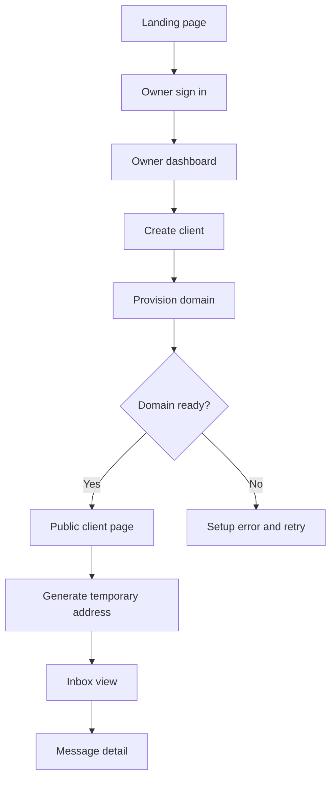

# MailHog UI Design System

## 1. Product Direction

MailHog is a multi-tenant temporary email platform. The owner provisions client spaces and connects their Cloudflare domains. Each client then receives a focused public inbox experience.

The UI should feel like a calm **Cloudflare control room**, not a generic SaaS admin template:

- Operational and trustworthy for the owner.
- Fast and private for the client.
- Clear about infrastructure state and delivery status.
- Minimal visual noise around email content.
- Responsive by default, especially for client inboxes on mobile.

Primary implementation target:

```text
SvelteKit + Svelte 5
Tailwind CSS v4
shadcn-svelte component pattern
Dark slate theme with cyan operational accent
```

## 2. Users And Jobs

### Owner

The owner manages the platform and client infrastructure.

Primary jobs:

1. See how many clients and messages exist.
2. Create a new client space.
3. Provision a Cloudflare domain with a token.
4. Understand exactly which provisioning step is running or failed.
5. Open a client's public inbox page.
6. Retry a failed setup without creating duplicate routing rules.

### Client

The client uses a public temp mail space without seeing Cloudflare complexity.

Primary jobs:

1. Choose an available domain.
2. Generate a disposable address.
3. Copy the address.
4. Wait for and read incoming messages.
5. Delete or hide messages when needed.
6. Understand whether the inbox is active, empty, or unavailable.

## 3. Information Architecture



### Routes

| Route            | Audience      | Purpose                               | Main data                                       |
| ---------------- | ------------- | ------------------------------------- | ----------------------------------------------- |
| `/`              | Everyone      | Explain the product and entry points  | Product positioning                             |
| `/login`         | Owner         | Sign in or create owner account       | Auth session                                    |
| `/dashboard`     | Owner         | Monitor clients and provision domains | `ownerDashboard`, `createClient`, `setupClient` |
| `/client/[slug]` | Client/public | Generate addresses and read inbox     | `clientPage`, `inbox`, `deleteEmail`            |

## 4. Visual Language

### Aesthetic

Use a blueprint-inspired dark interface. Surfaces should be layered, quiet, and readable. The visual hierarchy comes from spacing, type scale, and borders rather than glow effects.

Do not use:

- Purple, violet, or pink gradients.
- Neon multi-color dashboard styling.
- Animated glowing cards.
- Excessive rounded pills.
- Decorative illustrations that compete with inbox content.
- Emoji as interface icons.

### Color Tokens

The existing CSS variables in `apps/web/src/app.css` are the source of truth.

| Token              | Role                    | Intended use                             |
| ------------------ | ----------------------- | ---------------------------------------- |
| `background`       | Deep slate canvas       | Page background                          |
| `card`             | Raised slate surface    | Cards, panels, email rows                |
| `foreground`       | Primary text            | Headings and important values            |
| `muted-foreground` | Secondary text          | Descriptions, metadata, timestamps       |
| `primary`          | Cyan operational accent | Primary actions, active status, progress |
| `secondary`        | Dark slate control      | Secondary buttons and subdued surfaces   |
| `accent`           | Focused blue-slate      | Hover and selected states                |
| `destructive`      | Failure and deletion    | Errors, delete actions, failed setup     |
| `border`           | Quiet separation        | Cards, inputs, dividers                  |

Semantic status colors:

```text
ready       primary/cyan
validating  amber
running     primary/cyan
pending     muted
failed      destructive/red
completed   emerald/green with restrained contrast
```

Status color must always be accompanied by readable text. Never rely on color alone.

### Typography

Use a high-contrast but compact system:

- Display: `font-semibold`, tight tracking, 40 to 72px on landing.
- Section heading: 20 to 32px, medium or semibold.
- Body: 15 to 17px, line-height 1.6 to 1.8.
- Metadata: 12 to 14px, muted foreground.
- Email address and technical values: monospace or tabular numerals.
- Uppercase labels: 11 to 12px with increased letter spacing.

Avoid making every element bold. The owner dashboard should be scannable in under five seconds.

### Geometry And Motion

- Page radius: 12px to 20px for major panels.
- Control radius: 8px to 12px.
- Border: subtle, visible on dark backgrounds, never bright white.
- Main content width: 1120px to 1200px.
- Mobile page padding: 20px to 24px.
- Desktop page padding: 32px to 48px.
- Entrance animation: short fade-up only where useful.
- Respect `prefers-reduced-motion`.
- No continuous decorative animation.

## 5. Shared Shell

### Header

The header should adapt by context.

Owner context:

- MailHog wordmark on the left.
- `Dashboard` navigation link.
- Current account name/email.
- User menu with sign out.
- Optional environment/status indicator on desktop.

Client context:

- Client name or brand mark on the left.
- Domain/status label.
- Copy address or refresh actions on the right when an address exists.
- Avoid owner navigation and infrastructure terminology.

Mobile behavior:

- Keep the wordmark and user action visible.
- Collapse secondary links into a menu.
- Never let the header force horizontal scrolling.

### Component Inventory

Use existing components from `apps/web/src/lib/components/ui` and extend the same API style.

Required reusable components:

- `Button`
- `Input`
- `Card`
- `Badge`
- `Alert`
- `Dialog`
- `DropdownMenu`
- `Tabs`
- `Tooltip`
- `Skeleton`
- `Separator`
- `Toast`
- `CopyButton`
- `StatusBadge`
- `SetupStepper`
- `EmailRow`
- `EmailViewer`

Keep feature components outside `ui`:

```text
apps/web/src/components/
  AppHeader.svelte
  OwnerNav.svelte
  ClientHeader.svelte
  SetupStepper.svelte
  ClientCard.svelte
  EmailAddressCard.svelte
  EmailList.svelte
  EmailRow.svelte
  EmailViewer.svelte
  EmptyState.svelte
  ErrorState.svelte
```

## 6. Landing Page

### Goal

Explain the product in one viewport and route owners to sign in. The landing page is not an email inbox.

### Layout

Desktop:

```text
┌─────────────────────────────────────────────────────────┐
│ Header                                                  │
├───────────────────────────────┬─────────────────────────┤
│ Eyebrow                        │ Product flow panel      │
│ Large headline                 │ 01 Create client        │
│ Supporting copy                │ 02 Verify Cloudflare    │
│ Owner console / sign in CTA   │ 03 Receive email        │
└───────────────────────────────┴─────────────────────────┘
```

Content:

- Eyebrow: `PRIVATE MAIL INFRASTRUCTURE`.
- Headline: `Disposable inboxes, provisioned in minutes.`
- Supporting text: emphasize owned domains and automated Cloudflare setup.
- Primary CTA: `Open owner console`.
- Secondary CTA: `Sign in`.
- Right panel: three-step operational flow.

States:

- Normal.
- Existing authenticated owner: primary CTA can go directly to `/dashboard`.
- Reduced motion: no entrance stagger.

## 7. Login Page

### Goal

Provide a focused authentication surface for the owner. Do not expose Cloudflare setup before authentication.

Layout:

- Centered auth card on a quiet slate canvas.
- Small MailHog brand lockup above the card.
- Sign in and sign up mode switch.
- Email and password fields.
- Primary submit button.
- Inline validation and server error area.
- Link back to landing page.

States:

- Idle.
- Submitting: disabled button with `Signing in...` or `Creating account...`.
- Invalid email/password.
- Invalid credentials.
- Network unavailable.
- Success redirect to `/dashboard`.

Accessibility:

- Every field has a visible label.
- Error text is associated with the field.
- Password visibility toggle must have an accessible label.
- Focus ring uses the primary ring token.

## 8. Owner Dashboard

### Goal

Make provisioning and operational status the center of the experience.

### Desktop Layout

```text
┌─────────────────────────────────────────────────────────┐
│ Owner header                                            │
├─────────────────────────────────────────────────────────┤
│ Eyebrow + heading                         account       │
│ Short operational summary                               │
├──────────────────────┬──────────────────────────────────┤
│ Clients KPI           │ Messages KPI                    │
├──────────────────────┴──────────────────────────────────┤
│ Create client panel                                     │
├─────────────────────────────────────────────────────────┤
│ Client spaces                                           │
│ ┌─────────────────────────────────────────────────────┐ │
│ │ Client identity       status                         │ │
│ │ Domain setup form     open public page               │ │
│ │ Domain rows + states                                  │ │
│ └─────────────────────────────────────────────────────┘ │
└─────────────────────────────────────────────────────────┘
```

### Header Area

- Label: `OWNER CONSOLE`.
- Heading: `Provision client spaces`.
- Supporting copy: explain that each client receives an isolated public inbox.
- Right side: signed-in owner identity and optional refresh action.

### KPI Cards

Required metrics:

- `Clients`: count from `ownerDashboard.clients.length`.
- `Messages received`: count from `ownerDashboard.emailCount`.

Visual behavior:

- Clients is the primary KPI.
- Messages is secondary but still prominent.
- Do not use identical gradients or decorative charts for both.
- Include loading skeletons before data arrives.

### Create Client Panel

Fields:

- `Client name`.

Actions:

- `Create client`.

Success behavior:

- Clear input.
- Refresh dashboard data.
- Add the new client card with `pending` status.
- Show a toast: `Client space created`.

Validation:

- Required.
- Minimum 2 characters.
- Maximum 80 characters.
- Preserve the server-generated slug as read-only information.

### Client Card

Each client card contains:

- Client name.
- Public slug.
- Overall status badge.
- Public page link.
- Domain setup form.
- Existing domain list.
- Latest setup state and error message.

Domain setup fields:

- `Domain`.
- `Cloudflare API token` with password masking.
- `Verify and setup` action.

Security copy below the token field:

```text
Used only for provisioning. The token is not stored.
```

Do not display the token after submission. Clear it after success or failure.

### Setup Stepper

Replace the current single status text with a visible stepper:

```text
1  Token verified
2  Zone found
3  Email Routing enabled
4  Catch-all Worker rule configured
5  Domain ready
```

Step states:

- `pending`: muted circle and text.
- `active`: cyan circle, spinner, current step label.
- `complete`: green/cyan check and completed label.
- `failed`: red indicator, short error, `Retry setup` action.

The API currently exposes `SetupJob.currentStep`, `status`, and `errorMessage`. Keep the UI mapping centralized in `SetupStepper.svelte`.

### Owner Dashboard States

Loading:

- Header remains visible.
- KPI skeleton cards.
- One large client-card skeleton.

Empty:

- Heading: `No client spaces yet`.
- Explain that creating a client is the first step.
- Keep the create form visible and prominent.

Error:

- Preserve cached data if available.
- Show an alert with `Could not load owner data`.
- Provide `Retry`.

Provisioning failure:

- Never show `ready` optimistically.
- Show the exact safe error returned by the service.
- Never expose Cloudflare token or request headers.

## 9. Public Client Inbox

### Goal

The client page should feel like a lightweight disposable mailbox, not an admin panel.

### Layout

```text
┌─────────────────────────────────────────────────────────┐
│ Client identity                         domain status   │
├─────────────────────────────────────────────────────────┤
│ Choose a domain                                        │
│ [example.com] [another-domain.com]                      │
├─────────────────────────────────────────────────────────┤
│ Temporary address card                                  │
│ random@example.com                         Copy         │
│ Refresh inbox   Generate new address                    │
├───────────────────────────────┬─────────────────────────┤
│ Inbox list                    │ Message viewer          │
│ sender / subject / time       │ subject / metadata      │
│ unread indicator              │ safe content           │
└───────────────────────────────┴─────────────────────────┘
```

On mobile, the list and viewer become stacked sections. Selecting an email opens the viewer below the list or in a full-screen dialog.

### Domain Selection

- Show only domains with status `ready`.
- Failed or pending domains should appear in a disabled status section only if useful to the client.
- If no domain is ready, show an unavailable state rather than a broken generate button.

### Address Card

Required elements:

- Generated address in monospace.
- Copy button with clipboard success feedback.
- Generate new address button.
- Last refreshed timestamp.
- Optional expiry label when retention is implemented.

Address rules:

- Use a cryptographically secure random generator in production.
- Never expose internal client or domain IDs.
- Keep the address readable and selectable on mobile.

### Inbox List

Each email row shows:

- Read/unread state.
- Sender name or address.
- Subject or `(no subject)`.
- Relative time plus exact time in tooltip.
- Attachment indicator when attachments exist.
- Delete action in overflow menu.

Rows should be keyboard selectable and have a clear selected state.

### Email Viewer

Show:

- Subject.
- Sender.
- Recipient.
- Received time.
- Plain text body as the default safe rendering.
- HTML body only inside a strict sandboxed iframe when enabled.
- Attachment metadata without blindly rendering active content.

Never inject email HTML directly into the page DOM.

### Client Inbox States

Initial:

- Explain how to choose a domain and generate an address.

Waiting:

- `Waiting for incoming mail...`
- Refresh/poll control remains visible.

New mail:

- Highlight the new row once.
- Do not use loud notification animations.

Empty:

- `No messages yet`.
- Show the active address and copy action.

Domain unavailable:

- Explain that the client space is not ready.
- Do not expose Cloudflare API or implementation details.

Error:

- Keep the generated address visible.
- Show `Inbox could not be refreshed` and retry.

## 10. Interaction Rules

### Buttons

Primary actions:

- Use `Button` default variant.
- One primary action per visual region.
- Use explicit verbs: `Create client`, `Verify and setup`, `Copy address`, `Retry setup`.

Secondary actions:

- Use outline or ghost variants.
- Never style destructive actions as primary cyan actions.

### Forms

- Submit with Enter where safe.
- Disable only the affected form while submitting.
- Preserve unrelated input values.
- Show server errors near the form, not only in a toast.
- Clear Cloudflare token after setup response.

### Toasts

Use toasts for confirmation, not essential error information.

Good:

- `Client space created`.
- `Address copied`.
- `Domain provisioning started`.

Bad:

- Only showing `Setup failed` in a toast without inline detail.

### Destructive Actions

- Delete email must be explicit.
- Require confirmation on desktop for bulk actions.
- On mobile use an action sheet or confirmation dialog.
- Mark deleted messages optimistically only after the API confirms success.

## 11. Accessibility Requirements

- WCAG AA contrast for body text and controls.
- Visible keyboard focus for all interactive elements.
- No color-only status communication.
- All icon-only buttons have accessible labels.
- Forms use labels, descriptions, and error associations.
- Email list supports keyboard navigation.
- Dialogs trap focus and close with Escape.
- Loading states expose `aria-busy` where appropriate.
- Respect reduced motion preferences.
- Avoid horizontal overflow at 320px viewport width.

## 12. Responsive Breakpoints

### Small Mobile: 320px to 639px

- Single-column layout.
- Full-width buttons.
- Stack domain and token inputs.
- Email viewer below inbox list.
- Long addresses wrap safely.
- Header uses compact actions.

### Tablet: 640px to 1023px

- Two-column KPI grid.
- Client cards remain one column.
- Inbox can use list-first layout with viewer below.

### Desktop: 1024px and above

- Two-column landing page.
- Dashboard max width around 1120px.
- Client inbox list/viewer split.
- Setup forms can use inline grid.

## 13. API And UI Contract

Current procedures used by the UI:

| Procedure        | UI surface             | Required behavior                                 |
| ---------------- | ---------------------- | ------------------------------------------------- |
| `ownerDashboard` | Owner dashboard        | Return client list and message count              |
| `createClient`   | New client form        | Return generated client and slug                  |
| `setupClient`    | Setup form and stepper | Return setup status, current step, and safe error |
| `clientPage`     | Client shell           | Return client name, slug, and domain statuses     |
| `inbox`          | Inbox list/viewer      | Return messages scoped to client slug and address |
| `deleteEmail`    | Email row action       | Soft-delete only the requested tenant email       |

Recommended additions for complete UI support:

- `setupStatus(clientId)` for polling a long-running setup job.
- `markEmailRead(emailId, address, slug)`.
- `clientStats(slug)` for inbox count and last received time.
- `generateAddress(slug, domain)` using server-side secure randomness.
- `inboxStream(slug, address)` using SSE or short polling.

## 14. Security UX Rules

- Never render Cloudflare API tokens after submit.
- Never put Cloudflare tokens in URLs, logs, query keys, or client-side state after the request completes.
- Public client pages may read only their own domain/address scope.
- Do not reveal whether another tenant's address exists.
- Email HTML must be sandboxed.
- Attachment downloads must be explicit and safe.
- Rate-limit public inbox and address generation actions.
- Show generic production errors while logging details server-side.

## 15. Definition Of Done

### Owner flow

- Owner can sign in.
- Owner sees loading, empty, populated, and error dashboard states.
- Owner can create a client.
- Owner can provision a domain with a masked Cloudflare token.
- Setup stepper reflects current Cloudflare provisioning state.
- Failed setup can be retried.
- Ready client has a working public page link.

### Client flow

- Client can open `/client/[slug]` without owner navigation.
- Client can choose a ready domain.
- Client can generate and copy an address.
- Client sees empty, waiting, loaded, and failed inbox states.
- Client can select and read an email safely.
- Client can delete an email with confirmation.
- Layout works at 320px width and desktop widths.

### Quality

- `bun run --filter web check` passes with zero diagnostics.
- `bun run --filter web build` passes.
- No secrets or generated build output are committed.
- UI uses shared shadcn-svelte components instead of repeated custom controls.
- Status and errors are understandable without reading implementation details.
